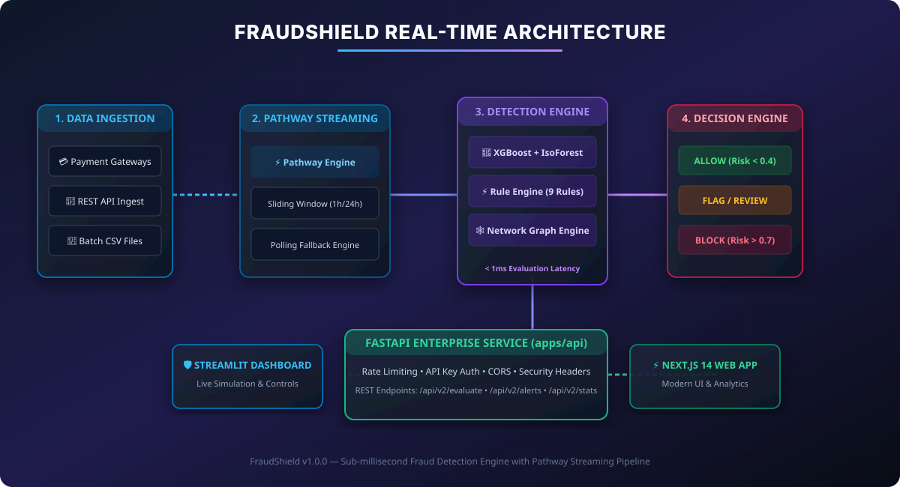
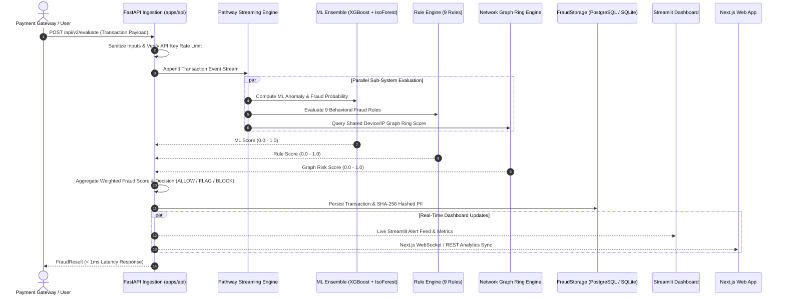
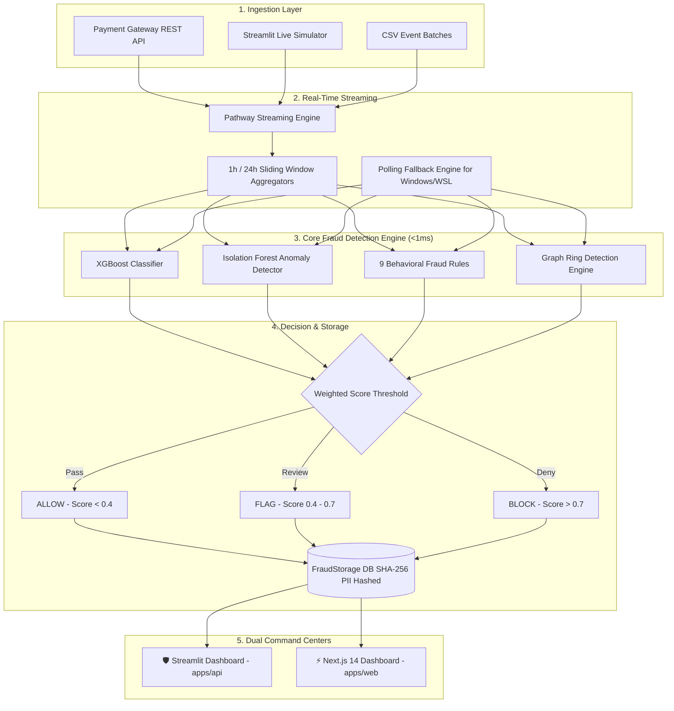

# 🛡️ FraudShield — Real-Time Sub-Millisecond Fraud Detection Pipeline

[](https://www.python.org/)
[](https://nextjs.org/)
[](https://fastapi.tiangolo.com/)
[](https://streamlit.io/)
[](https://pathway.com/)
[](LICENSE)
[]()
[](https://github.com/Shweta-Mishra-ai/fraudshield)

**FraudShield Real-Time** is an enterprise-grade, high-throughput fraud detection platform powered by **Pathway** real-time streaming pipelines, an **ML Ensemble (XGBoost + Isolation Forest)**, a **Dynamic 9-Rule Engine**, and a **User-Device-IP Graph Ring Analytics Engine**.

Designed to evaluate credit card and digital transaction streams with **sub-millisecond latency (<1ms evaluation per transaction)**, FraudShield provides dual monitoring command centers: a **Streamlit Live Control Center** and a modern **Next.js 14 Web Application**.

> 🌟 **Enjoying FraudShield? Please give this repository a ⭐ Star on GitHub — it helps the project grow and reach more developers!**

---

## 🚀 Live Deployments

| Platform | URL | Description |
|----------|-----|-------------|
| 🌐 **Next.js Web App** | [fraudshield-blue-seven.vercel.app](https://fraudshield-blue-seven.vercel.app/) | Full landing page + live fraud demo |
| 📊 **Streamlit Dashboard** | [realtime-fraud-pathway-yk6vymdmgdfsue6lbappytf.streamlit.app](https://realtime-fraud-pathway-yk6vymdmgdfsue6lbappytf.streamlit.app/) | Live analytics & control center |
| ⚙️ **FastAPI Backend** | [fraudshield-hmas.onrender.com](https://fraudshield-hmas.onrender.com/) | REST API + Swagger Docs (`/docs`) |
| 📖 **API Docs (Swagger)** | [fraudshield-hmas.onrender.com/docs](https://fraudshield-hmas.onrender.com/docs) | Interactive API reference |

---

## 📚 Quick Documentation Links

- 📘 **[System Overview & Maintenance Guide (DOCUMENTATION.md)](DOCUMENTATION.md)** — What FraudShield is, computer maintenance, & school computer specs.
- 📖 **[Detailed Setup & Installation Guide (SETUP_GUIDE.md)](SETUP_GUIDE.md)** — Step-by-step local, Docker, & production deployment guide.
- 🤝 **[Contribution Guidelines (CONTRIBUTING.md)](CONTRIBUTING.md)** — Code standards, PR checklist, and development workflow.
- 📊 **[Real-Time Benchmark Report (DEMO_OUTPUT.md)](DEMO_OUTPUT.md)** — Live execution latency & fraud detection metrics.
- 📐 **[System Architecture Guide (docs/ARCHITECTURE.md)](docs/ARCHITECTURE.md)** — In-depth technical architecture blueprint.

---

## 📋 Table of Contents

1. [System Architecture & Dataflow](#-system-architecture--dataflow)
2. [Core Features](#-core-features)
3. [Repository Directory Structure](#-repository-directory-structure)
4. [Step-by-Step Setup Guide](#-step-by-step-setup-guide)
5. [Step-by-Step Contribution Workflow](#-step-by-step-contribution-workflow)
6. [Local Testing & Verification](#-local-testing--verification)
7. [REST API Endpoint Reference](#-rest-api-endpoint-reference)
8. [Support & Give a Star](#-support--give-a-star)
9. [License & Versioning](#-license--versioning)

---

## 📐 System Architecture & Dataflow

### Visual System Architecture Diagram


---

### 🔄 End-to-End Real-Time Streaming Sequence



---

### 🧩 Component Dependency Flowchart



---

## ✨ Core Features

- **⚡ Sub-Millisecond Evaluation**: Benchmarked at `<0.3ms` evaluation latency per transaction.
- **🌊 Pathway Streaming Integration**: Real-time sliding window aggregates (1h/24h transaction counts, sums, velocity) with automated polling engine fallback on non-Linux environments.
- **🤖 Multi-Layered Scoring**:
  - **XGBoost Classifier + Isolation Forest** anomaly detection.
  - **9 Deterministic Fraud Rules** (High amount, velocity spikes, night-time foreign transactions, new device/IP, etc.).
  - **Network Graph Engine** detecting shared device/IP fraud rings.
- **🔒 Enterprise Security**:
  - Automatic **SHA-256 PII Hashing** for IP addresses and device IDs before storage.
  - Built-in **Rate Limiting (HTTP 429)**, API Key Verification, and strict security headers (`X-Frame-Options`, `X-Content-Type-Options`, CSP).
- **🖥️ Dual Command Center Dashboards**:
  - **Streamlit Live Simulator & Command Center** (`streamlit run app.py`).
  - **Next.js 14 Web Application** with Tailwind CSS (`cd apps/web && npm run dev`).

---

## 📂 Repository Directory Structure

```
fraudshield/
├── app.py                      # Top-level Streamlit entrypoint
├── generate_demo_output.py     # Demo benchmark generator
├── requirements.txt            # Master Python dependencies
├── SETUP_GUIDE.md              # Complete step-by-step setup guide
├── CONTRIBUTING.md             # Open-source contribution guidelines
├── Makefile                    # Automation commands (test, run, build)
├── render.yaml                 # Deployment blueprint for Render
├── vercel.json                 # Deployment configuration for Vercel
├── DEMO_OUTPUT.md              # Real-time evaluation output report
├── apps/
│   ├── api/                    # Core Python API & Detection Engine
│   │   ├── config/             # Environment & System Settings
│   │   ├── dashboard/          # Streamlit Command Center (app.py)
│   │   ├── data/               # SQLite DB & Models Storage
│   │   ├── src/
│   │   │   ├── api/            # FastAPI REST Service (main.py)
│   │   │   ├── core/           # Detector, Rules, Models, Graph Engine
│   │   │   ├── ml/             # XGBoost & IsoForest Ensemble
│   │   │   ├── security/       # Rate Limiter & Sanitization
│   │   │   └── streaming/      # Pathway Streaming Pipeline
│   │   └── tests/              # Unit & Integration Tests (178 Tests)
│   └── web/                    # Next.js 14 Web Dashboard App
│       ├── app/                # React App Router pages & dashboards
│       ├── components/         # Modern UI Tailwind components
│       └── package.json        # Frontend Node.js dependencies
└── docs/                       # Architecture diagrams & API reference
    └── assets/                 # High-resolution SVG diagrams
```

---

## ⚙️ Step-by-Step Setup Guide

For full instructions, read the dedicated **[SETUP_GUIDE.md](SETUP_GUIDE.md)**.

### Step 1: Clone Repository & Create Virtual Environment
```bash
git clone https://github.com/Shweta-Mishra-ai/fraudshield.git
cd fraudshield

# Create Python virtual environment
python -m venv venv

# Activate virtual environment
# On Linux/macOS:
source venv/bin/activate
# On Windows PowerShell:
.\venv\Scripts\Activate.ps1
```

### Step 2: Install Python & Node Dependencies
```bash
# Install backend dependencies
pip install --upgrade pip
pip install -r requirements.txt

# Install frontend dependencies
cd apps/web
npm install
cd ../..
```

### Step 3: Launch Services

#### Launch Option 1: Streamlit Command Center
```bash
streamlit run app.py
```
*Access in browser: **[http://localhost:8501](http://localhost:8501)** *

#### Launch Option 2: FastAPI Backend API Server
```bash
python -m uvicorn apps.api.src.api.main:app --reload --port 8000
```
*Swagger API Docs: **[http://localhost:8000/docs](http://localhost:8000/docs)** *

#### Launch Option 3: Next.js 14 Web Application
```bash
cd apps/web
npm run dev
```
*Access in browser: **[http://localhost:3000](http://localhost:3000)** *

---

## 🤝 Step-by-Step Contribution Workflow

For complete contribution guidelines, read the **[CONTRIBUTING.md](CONTRIBUTING.md)**.

### Step 1: Create a Feature Branch
```bash
git checkout -b feat/your-feature-name
```

### Step 2: Format Code & Lint
Maintain strict formatting before committing:

```bash
# Format Python Backend
cd apps/api
black src/ config/ tests/ --line-length=100
ruff check src/ config/ tests/ --select=E,W,F --ignore=E501

# Typecheck Frontend
cd apps/web
npx tsc --noEmit
```

### Step 3: Run Automated Tests
```bash
# Python Backend Test Suite (178 tests)
python apps/api/run_tests.py
pytest apps/api/tests

# Next.js Production Build Test
cd apps/web
npm run build
```

### Step 4: Open a Pull Request
Push your branch and open a PR targeting the `main` branch. Ensure your PR title follows conventional commits (`feat:`, `fix:`, `docs:`, `refactor:`).

---

## 🧪 Local Testing & Verification

Execute all test suites locally:

```bash
# Run Master Test Runner
python apps/api/run_tests.py

# Run Pytest Integration & Security Tests
pytest apps/api/tests

# Generate Benchmark Report
python generate_demo_output.py
```

---

## 📡 REST API Endpoint Reference

| Method | Endpoint | Description | Auth Required |
| :--- | :--- | :--- | :---: |
| `POST` | `/api/v2/evaluate` | Evaluate transaction payload in real-time | Yes (`X-API-Key`) |
| `GET` | `/api/v2/alerts` | Fetch recent fraud alerts and flagged transactions | Yes (`X-API-Key`) |
| `POST` | `/api/v2/alerts/{id}/review` | Submit analyst review (Approve/Reject) | Yes (`X-API-Key`) |
| `GET` | `/api/v2/stats` | Fetch real-time system throughput & fraud metrics | Yes (`X-API-Key`) |
| `GET` | `/api/v2/health` | Health check endpoint | No |

---

## ⭐ Support & Give a Star

If you find FraudShield helpful, inspiring, or useful for your projects, please take a second to **give it a Star ⭐ on GitHub**! Your support motivates continuous improvement and open-source contributions.

<p align="center">
  <a href="https://github.com/Shweta-Mishra-ai/fraudshield">
    
  </a>
</p>

---

## 📄 License & Versioning

- **Version**: `v1.0.0`
- **License**: MIT License — free for open-source and commercial use.

---
*Built with ❤️ for High-Throughput Real-Time Fraud Prevention.*
