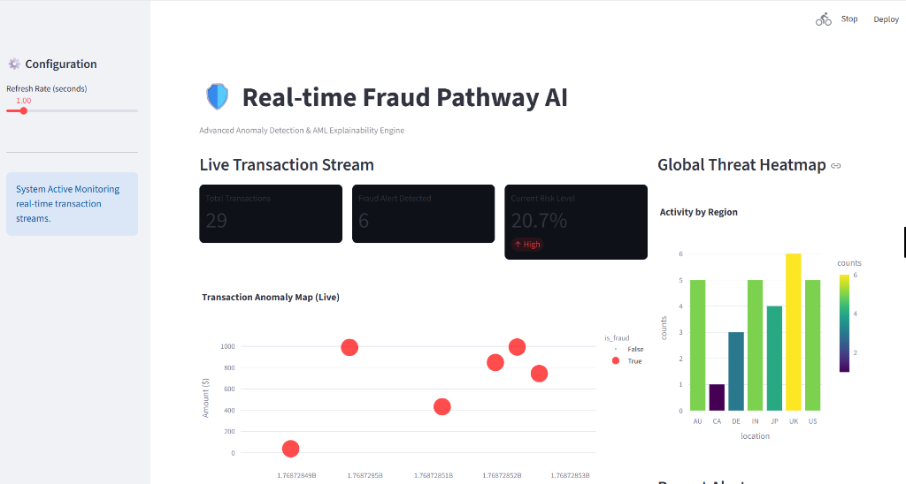

# 🛡️ Real-time Fraud Pathway AI v2.0

> **Advanced ML & Graph Analytics Engine**

A production-ready, enterprise-grade fraud detection system with **Machine Learning** and **Graph Intelligence**. Built for the Pathway Hackathon, this project demonstrates cutting-edge AI techniques for financial crime prevention.




---

## 🚀 Key Features

### Phase 1: Core System
*   **Real-time Processing**: High-velocity transaction stream simulation
*   **Modular Architecture**: Clean separation with `Generator`, `Detector`, and `Storage` modules
*   **Rule-Based Detection**: Behavioral profiling for "Location Jumps" and "High Velocity" patterns
*   **Persistent Storage**: SQLite for audit trails and historical analysis
*   **Interactive Dashboard**: Live metrics, geospatial heatmaps, and scatter plots

### Phase 2: AI & Graph Intelligence ⚡ NEW
*   **🧠 Machine Learning**: Unsupervised anomaly detection using **Isolation Forest**
    *   Multi-dimensional pattern recognition
    *   Auto-retraining every 100 transactions
    *   Feature-based scoring (Amount, Location, Device, IP)
*   **🕸️ Graph Analytics**: Fraud ring detection using **NetworkX**
    *   Real-time relationship mapping (Users ↔ Devices ↔ IPs)
    *   Community detection for organized crime patterns
    *   Shared resource analysis (flag devices used by 3+ users)
*   **📊 Advanced Visualization**:
    *   **Tab 1**: Live transaction monitoring
    *   **Tab 2**: Network graph of fraud rings
    *   **Tab 3**: ML insights and model performance

---

## 🔍 Live Demo Output

Since live execution requires a Python environment, we have provided captured logs showing real fraud detection logic in action.

👉 **[View Real Demo Logs](./DEMO_OUTPUT.md)**

This log demonstrates:
*   ML-detected anomalies with feature analysis
*   Fraud ring alerts from graph clustering
*   Rule-based vs. AI-based detection comparison

---

## 🏗️ Project Structure

```bash
├── src/
│   ├── detector.py       # ML + Rule-based fraud engine  ⚡ UPDATED
│   ├── graph_engine.py   # NetworkX fraud ring detection  ⚡ NEW
│   ├── generator.py      # Transaction stream simulator
│   ├── models.py         # Data classes
│   └── storage.py        # SQLite persistence
├── assets/               # Screenshots and media
├── app.py                # Streamlit dashboard (3 tabs)  ⚡ UPDATED
├── requirements.txt      # Dependencies  ⚡ UPDATED
└── README.md
```

---

## 🛠️ Installation & Setup

1.  **Clone the repository**
    ```bash
    git clone https://github.com/Shwetam77777/realtime-fraud-pathway.git
    cd realtime-fraud-pathway
    ```

2.  **Install dependencies**
    ```bash
    pip install -r requirements.txt
    ```

3.  **Run the application**
    ```bash
    streamlit run app.py
    ```

4.  **Navigate Tabs**
    *   📊 **Live Dashboard**: Real-time transaction monitoring
    *   🕸️ **Graph Intelligence**: Fraud ring network visualization
    *   🧠 **ML Insights**: Model performance and anomaly details

---

## 🧠 How It Works

### Traditional Rule-Based Detection
1.  Transaction arrives → Evaluated against rules (High Amount, Location Jump)
2.  Risk score assigned → Alert if score > 0.5

### Phase 2: AI-Powered Detection
1.  **ML Model**: Isolation Forest learns "normal" behavior from historical data
2.  **Graph Engine**: Builds a network of Users-Devices-IPs in real-time
3.  **Fraud Rings**: Detects when 3+ users share the same device/IP (mass theft indicator)
4.  **Combined Scoring**: Takes maximum risk from Rules, ML, and Graph signals

---

## 📈 Technical Highlights

*   **Isolation Forest**: Unsupervised learning, no labeled data needed
*   **NetworkX**: Graph traversal with O(N) community detection
*   **Streamlit**: Real-time dashboard with <1s refresh rate
*   **Modular Design**: Easy to add new ML models or graph algorithms

---

## 🔮 Future Roadmap

*   [ ] SHAP explanations for ML predictions
*   [ ] Kafka integration for production streaming
*   [ ] Deep learning (LSTM) for sequential fraud patterns
*   [ ] REST API for model serving

---

Built with ❤️ by [Shweta Mishra](https://github.com/Shwetam77777)
